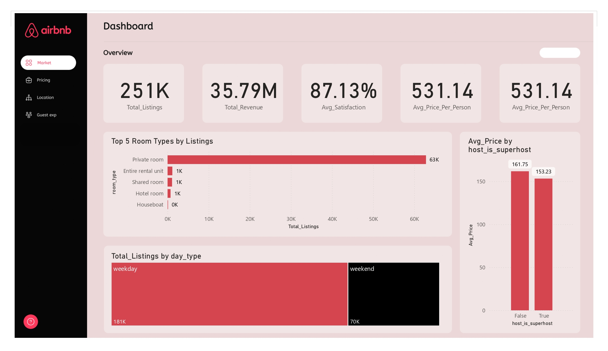
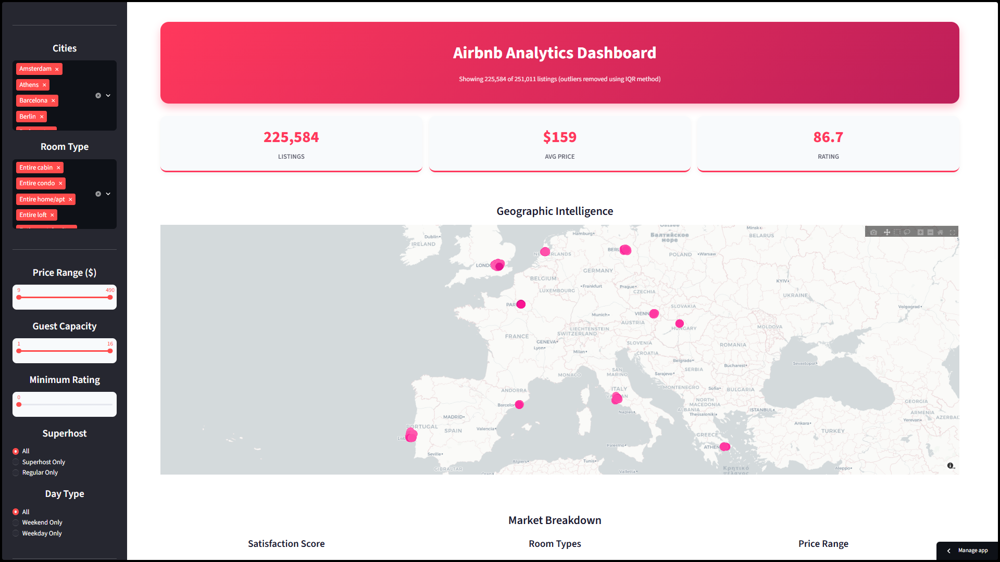
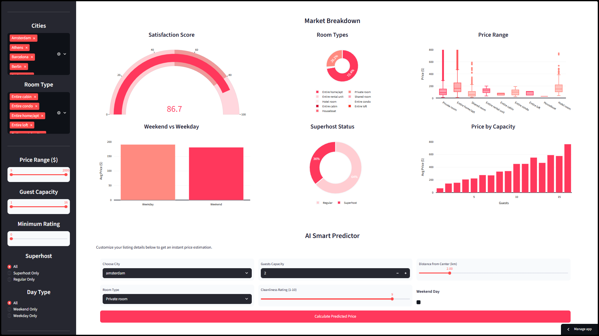
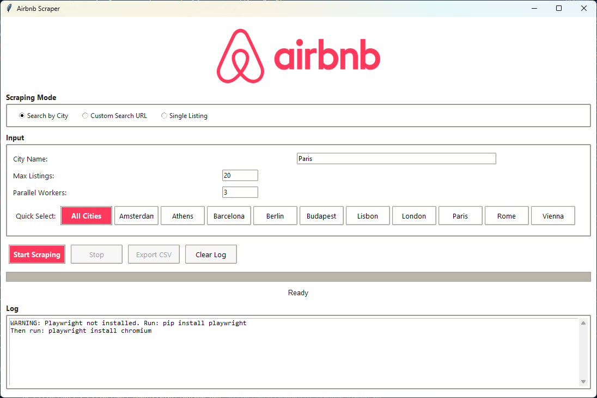
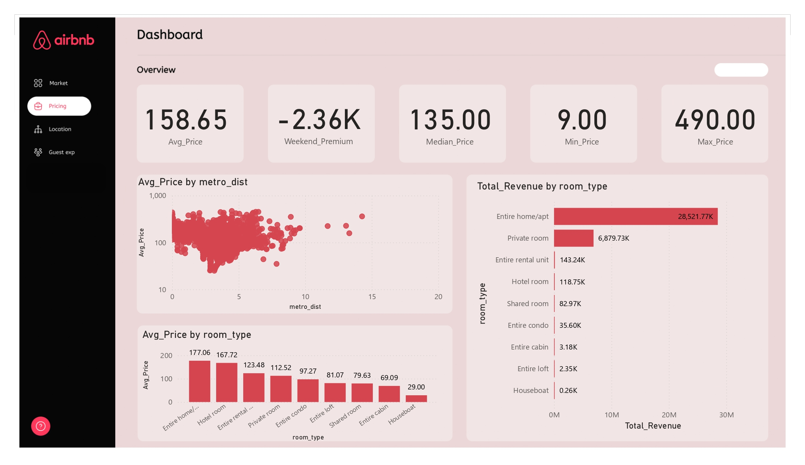
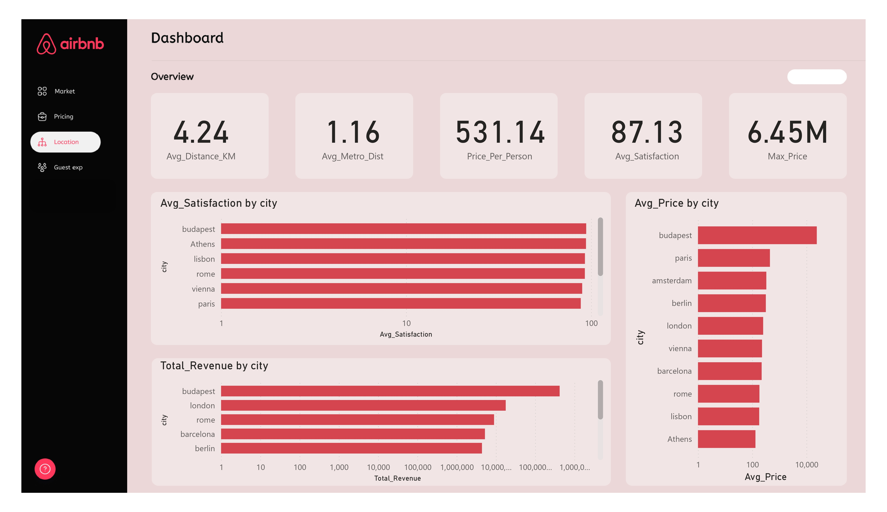
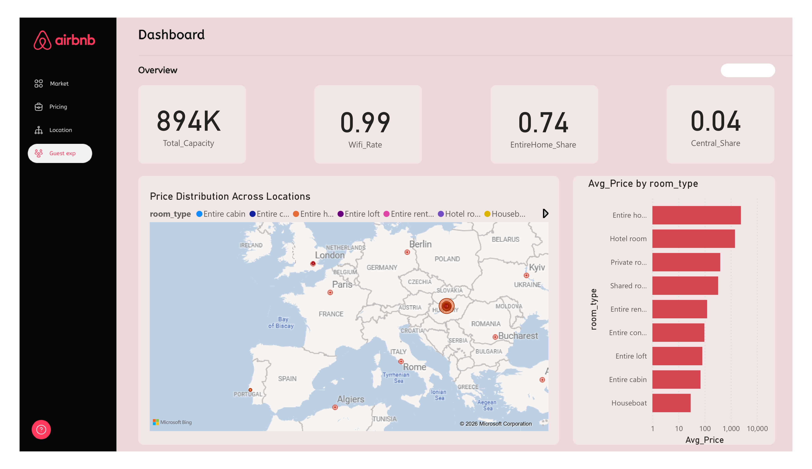
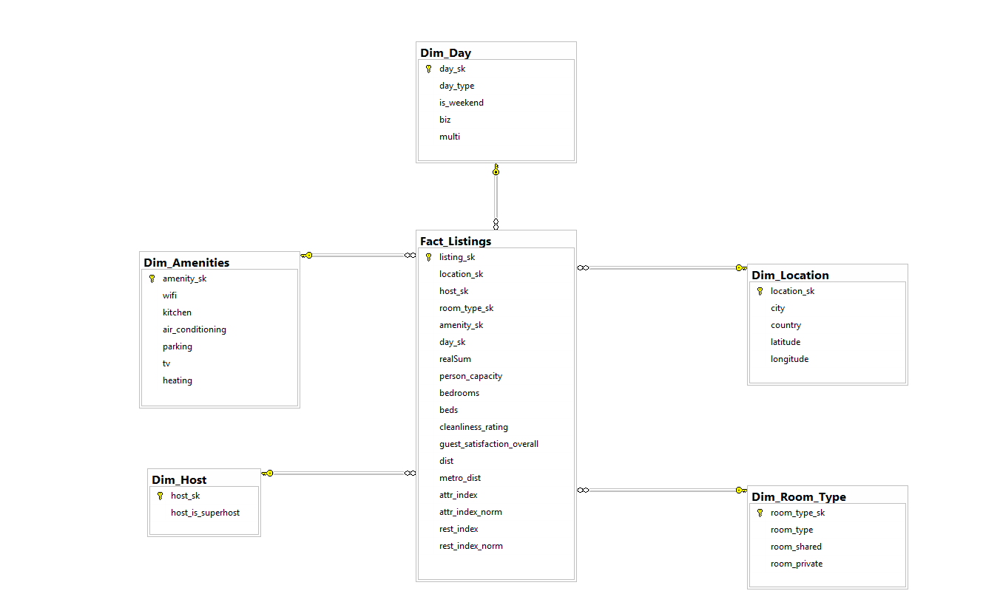

<div align="center">


#  Airbnb Analytics

### ✨ Scrape · Clean · Warehouse · Analyze · Predict ✨

<br>

[](https://airbnb-analytics.streamlit.app/)

<br>

[](https://python.org)
[](https://www.r-project.org)
[](https://www.microsoft.com/sql-server)
[](https://powerbi.microsoft.com)
[](https://streamlit.io)
[](https://catboost.ai)

<br>

🔢 **251,000+ listings** · 🌍 **10 European cities** · 🔄 **End-to-end pipeline**

`Amsterdam` `Athens` `Barcelona` `Berlin` `Budapest` `Lisbon` `London` `Paris` `Rome` `Vienna`

</div>

<br>

<p align="center">
  
</p>

<br>

## 💡 What Is This?

A complete data analytics project that goes from **raw web scraping** all the way to **ML-powered price prediction**. We built custom scrapers to collect Airbnb listing data across Europe, cleaned and warehoused it in a star schema, ran statistical tests in R, built Power BI dashboards, and deployed an interactive Streamlit app with a CatBoost model that predicts nightly prices in real time.

> 💬 This isn't just a notebook. It's a **production-grade pipeline** with 6 interconnected components.

<br>

## 🔄 Pipeline

```
         ┌──────────────┐
         │  🕷️ SCRAPER   │   Playwright + Chromium
         │  CLI & GUI    │   Anti-detection, parallel workers
         └──────┬───────┘
                │
                ▼
         ┌──────────────┐
         │  🧹 CLEANING  │   Pandas, KNN Imputer (k=3)
         │  & MERGING    │   Feature engineering, normalization
         └──────┬───────┘
                │
                ▼
         ┌──────────────┐
         │  🗃️ STAR      │   SQL Server DW
         │  SCHEMA       │   MD5-hashed dimension keys
         └──────┬───────┘
                │
       ┌────────┼────────┐
       ▼        ▼        ▼
  ┌─────────┐ ┌──────┐ ┌──────────┐
  │📊POWERBI│ │📈 R  │ │🤖STREAM- │
  │ 4 pages │ │ANOVA │ │  LIT +   │
  └─────────┘ │MANOVA│ │ CatBoost │
              └──────┘ └──────────┘
```

<br>

## 🤖 Streamlit App

<table>
  <tr>
    <td width="50%"></td>
    <td width="50%"></td>
  </tr>
  <tr>
    <td align="center"><b>🗺️ Interactive Plotly Map</b><br><sub>1,500 listings · color-coded by price · click to predict</sub></td>
    <td align="center"><b>📈 Analytics Dashboard</b><br><sub>6 charts · 3 KPIs · 7 filters · real-time updates</sub></td>
  </tr>
</table>

<div align="center">

### **[🚀 Launch the App →](https://airbnb-analytics.streamlit.app/)**

</div>

| | Feature |
|---|---------|
| 🎛️ | **7 sidebar filters** for city, room type, price ($0–$490), guest capacity, rating, superhost, weekend/weekday |
| 🗺️ | **Interactive map** where clicking any listing dot auto-fills the AI predictor |
| 🤖 | **AI price predictor** using CatBoost on 6 features (city, room type, capacity, cleanliness, distance, weekend) |
| 📊 | **6 analytical charts** including satisfaction gauge, room type pie, price box plot, weekend bar, superhost donut, capacity bar |
| 🎬 | **Animated intro** with 3-second branded SVG splash screen |

<br>

## 🕷️ Scraper

<p align="center">
  
</p>

Two scraper versions, both using **Playwright** with headless Chromium and anti-bot stealth mode:

| | Version | Description |
|---|---------|-------------|
| ⌨️ | **`scraper_cli.py`** | Command-line version. Pass a city name, get back a CSV + JSON with prices, coordinates, amenities, ratings, and room details |
| 🖥️ | **`scraper_gui.py`** | Full Tkinter GUI with quick-select buttons for all 10 cities, parallel scraping, real-time log, progress bar, per-city auto-save |

> 📦 Both extract: `price` · `room_type` · `lat/lng` · `guest_capacity` · `bedrooms` · `beds` · `ratings` · `superhost` · `wifi` · `kitchen` · `AC` · `parking` · `TV` · `heating`

<br>

## 📂 Repository Structure

```
airbnb-analytics/
│
├── 🤖 app/                           # Streamlit web application
│   ├── app.py                        #   Dashboard + AI predictor (573 lines)
│   ├── airbnb_model.cbm              #   Trained CatBoost model
│   ├── airbnb_symbol.svg             #   Intro animation logo
│   └── data/
│       └── airbnb_listings_clean.csv  #   Clean dataset (251k rows, 30+ cols)
│
├── 🕷️ scraper/                       # Web scraping tools
│   ├── scraper_cli.py                #   CLI scraper (661 lines)
│   ├── scraper_gui.py                #   GUI scraper with Tkinter (1,270 lines)
│   ├── scraper_screenshot.png        #   GUI screenshot
│   ├── logo_base64.txt               #   Embedded logo for GUI
│   └── WEEKEND_SCRAPING_GUIDE.md     #   Weekend mode docs
│
├── 🧹 cleaning/                      # Data cleaning pipeline
│   ├── clean_and_merge.ipynb         #   Jupyter notebook (27 cells)
│   ├── all_cities.csv                #   Source dataset 1
│   └── scraped_data.csv              #   Source dataset 2 (254 MB)
│
├── 🗃️ schema/                        # Database & data warehouse
│   ├── star_schema.sql               #   DDL: 5 dim + 1 fact table
│   ├── analysis.sql                  #   9 analytical queries (849 lines)
│   ├── hashing.ipynb                 #   MD5 dimension ID generator
│   ├── schema_diagram.png            #   Star schema visual
│   ├── erd.pdf                       #   Entity-relationship diagram
│   ├── fact_table_output.csv         #   Exported fact table
│   └── final_raw_with_ids.csv        #   Full dataset with dim IDs (73 MB)
│
├── 📈 r_statistics/                  # Statistical analysis
│   └── stat.R                        #   ANOVA & MANOVA (190 lines)
│
├── 📊 dashboard/                     # Power BI dashboard
│   └── screenshots/                  #   Preview images & dashboard file
│       └── airbnb_dashboard.pbix     #   4-page interactive dashboard
│
├── 📄 requirements.txt               # Python dependencies
├── 📄 .gitattributes                 # Git LFS rules
└── 📄 .gitignore                     # Exclusions
```

<br>

## 🔍 Deep Dive

### 🤖 `app/` Streamlit + CatBoost

| File | Description |
|------|-------------|
| **`app.py`** | 573-line Streamlit dashboard. Animated intro → sidebar with 7 filters → 3 KPI cards → Plotly scatter map (1,500 sampled listings, click-to-predict) → 6 charts → AI predictor form. Uses `st.session_state` for map click integration |
| **`airbnb_model.cbm`** | CatBoost Regressor trained on `log(price)`. Features: city, room type, person capacity, cleanliness rating, distance to center, weekend flag. Predictions converted back via `np.expm1()` |
| **`data/airbnb_listings_clean.csv`** | Single source of truth. 251k listings with price, coordinates, amenities, ratings, and engineered features |

### 🕷️ `scraper/` Playwright Automation

| File | Description |
|------|-------------|
| **`scraper_cli.py`** | 661 lines. Headless Chromium → navigate search pages → progressive scroll with URL extraction → parallel `ThreadPoolExecutor` detail scraping → JSON + CSV output. Anti-bot: random delays, stealth JS injection, custom user-agent |
| **`scraper_gui.py`** | 1,270 lines. Tkinter wrapper with mode selection (city/URL/single listing), 10-city quick buttons, configurable parallel workers, weekend mode, real-time log, progress bar, auto-save per city |
| **`WEEKEND_SCRAPING_GUIDE.md`** | How to scrape weekend-specific pricing and merge it with the enrichment pipeline |

### 🧹 `cleaning/` Pandas + KNN Imputation

**`clean_and_merge.ipynb`** (27 cells):

| Step | What happens |
|------|-------------|
| 1️⃣ | Load `all_cities.csv` + `scraped_data.csv` |
| 2️⃣ | Normalize columns (cleanliness 10→5 scale, rename lat/lng) |
| 3️⃣ | Create binary flags (`room_shared`, `room_private`) |
| 4️⃣ | Extract city from host location, filter to 10 target cities |
| 5️⃣ | Engineer features: weekend indicator, 6 amenity booleans |
| 6️⃣ | Merge via `pd.concat` |
| 7️⃣ | KNN imputation (k=3, distance-weighted, batched by 100 rows) |
| 8️⃣ | Export final clean CSV |

### 🗃️ `schema/` SQL Server Star Schema

**`star_schema.sql`** creates the `Airbnb_DW` warehouse:

| Table | Type | Key Columns |
|-------|------|-------------|
| `Dim_Location` | 📍 Dimension | city, country, lat, lng |
| `Dim_Host` | 👤 Dimension | superhost status |
| `Dim_Room_Type` | 🏠 Dimension | room type, shared/private flags |
| `Dim_Amenities` | 🛜 Dimension | wifi, kitchen, AC, parking, TV, heating |
| `Dim_Day` | 📅 Dimension | day type, weekend, biz, multi |
| `Fact_Listings` | ⭐ Fact | price, capacity, bedrooms, beds, ratings, distances, indices |

**`analysis.sql`** contains 9 advanced queries:

| # | Query | What it does |
|---|-------|-------------|
| 1 | 🎯 ListingScore | Score listings against city/room-type benchmarks |
| 2 | 📋 SegmentDashboard | Aggregate metrics by city × room-type |
| 3 | 💰 BestDeals / WorstDeals | Find under/overpriced listings |
| 4 | 🚇 AccessibilitySegment | Metro-accessible vs center-close comparison |
| 5 | 🏷️ AmenityTier | Classify as Basic / Comfort / Full |
| 6 | 🔗 InsightColumns AllInOne | Combined analytical view |
| 7 | 📡 FeatureImpactRadar | Price premium/discount per feature |
| 8 | 🌐 GeoDemandHotspots | Geographic grid demand analysis |
| 9 | 🧮 StrategyScoring | Weekend + amenity pricing strategies |

**`hashing.ipynb`** generates MD5-hashed integer IDs for each dimension, merges them back, exports `final_raw_with_ids.csv`

### 📈 `r_statistics/` ANOVA & MANOVA

**`stat.R`** (190 lines):

| Test | What it does |
|------|-------------|
| 📊 **ANOVA** | Tests whether mean price differs across room types. Tukey HSD post-hoc identifies which pairs differ. Boxplots + error bars |
| 📉 **MANOVA** | Tests multivariate effect of room type on price + satisfaction + cleanliness simultaneously. Wilks' Lambda. Scatter pairs + grouped bar charts |

> 🎨 All visualizations use the Airbnb brand palette (`#FF5A5F`, `#FBB6B8`, `#C81E1E`)

<br>

## 📊 Power BI Dashboard

<table>
  <tr>
    <td width="50%"></td>
    <td width="50%"></td>
  </tr>
  <tr>
    <td align="center"><b>📋 Overview</b></td>
    <td align="center"><b>🌍 City Comparison</b></td>
  </tr>
  <tr>
    <td width="50%"></td>
    <td width="50%"></td>
  </tr>
  <tr>
    <td align="center"><b>💰 Pricing Analysis</b></td>
    <td align="center"><b>🏡 Host & Amenity Insights</b></td>
  </tr>
</table>

<br>

## 🗃️ Star Schema

<p align="center">
  
</p>

<br>

## 🛠️ Tech Stack

| Layer | Tools |
|-------|-------|
| 🕷️ **Scraping** | Python · Playwright · Chromium |
| 🧹 **Cleaning** | Pandas · NumPy · Scikit-learn (KNN) |
| 🗃️ **Database** | SQL Server · Star Schema |
| 📈 **Statistics** | R · dplyr · ANOVA · MANOVA |
| 📊 **BI Dashboard** | Power BI (4 pages) |
| 🤖 **ML** | CatBoost Regressor |
| 🌐 **Web App** | Streamlit · Plotly |
| 💾 **Storage** | Git LFS |

<br>

## 🚀 Quick Start

```bash
# Clone (requires Git LFS for large files)
git lfs install
git clone https://github.com/Ahmed-Esso/airbnb-analytics.git
cd airbnb-analytics

# Setup
python -m venv venv
venv\Scripts\activate        # Windows
pip install -r requirements.txt

# Run
streamlit run app/app.py
```

<details>
<summary>🕷️ <b>Run the scraper (optional)</b></summary>

```bash
pip install playwright
playwright install chromium

python scraper/scraper_cli.py    # CLI version
python scraper/scraper_gui.py    # GUI version
```

</details>

<details>
<summary>📈 <b>Run R statistics (optional)</b></summary>

```r
setwd("path/to/airbnb-analytics")
source("r_statistics/stat.R")
```

</details>

<details>
<summary>🗃️ <b>Set up SQL Server warehouse (optional)</b></summary>

1. Open `schema/star_schema.sql` in SSMS
2. Update the `BULK INSERT` path to your local `schema/final_raw_with_ids.csv`
3. Execute to create `Airbnb_DW` and populate all tables
4. Run `schema/analysis.sql` for the 9 analytical queries

</details>

<br>

## 👥 Team

<table>
  <tr>
    <td align="center">
      <b>Ahmed Essam</b><br>
      <a href="https://github.com/Ahmed-Esso">@Ahmed-Esso</a>
    </td>
    <td align="center">
      <b>Mayar Hany</b><br>
      <a href="https://github.com/Mayar-hany-2005">@Mayar-hany-2005</a>
    </td>
    <td align="center">
      <b>Ziad Abdeen</b><br>
      <a href="https://github.com/ZiadDev123">@ZiadDev123</a>
    </td>
    <td align="center">
      <b>Seif Nour</b>
    </td>
  </tr>
</table>

<br>

---

<div align="center">

**🏠 Built for learning. Built for portfolios. Built with real data. 🏠**

<sub>This project is for educational and portfolio purposes.</sub>

</div>
